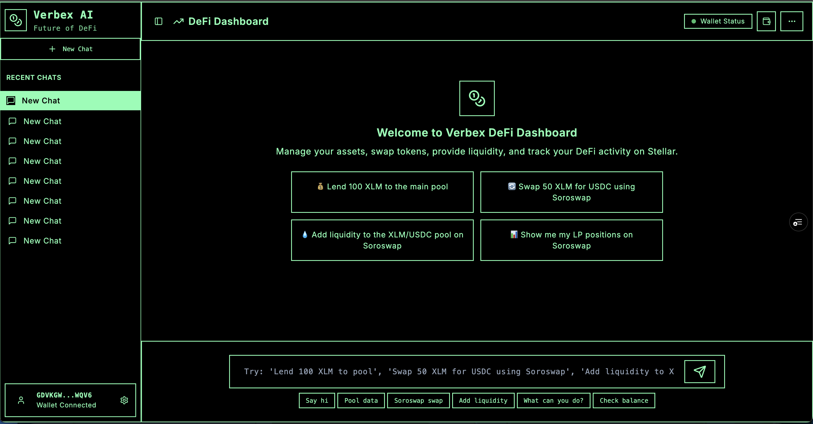

<div align="center">
  
  
  # 🚀 Verbex AI - Agentic DeFi Assistant
  
  > **AI-powered DeFi assistant with MCP integration for Stellar blockchain**
> 
  [](https://verbex-cbbtl89kx-tanishq162005-gmailcoms-projects.vercel.app)
  [](https://verbex-ai.onrender.com/sse)
</div>

## 🎬 Demo Video


https://github.com/user-attachments/assets/03f1c0c0-b14b-43c5-8f70-a745c5fa189a

## 🎯 Project Overview

Verbex AI transforms complex DeFi operations into simple conversations. We provide **two interfaces**:

1. **Web Assistant** - Conversational AI powered by Google Gemini
2. **MCP Server** - Universal AI gateway for any AI assistant

### 🌟 What We Do

- **Multi-Protocol DeFi**: Blend (lending), Soroswap (DEX), DeFindex (yield farming)
- **AI-Powered Conversations**: Execute complex strategies through natural language
- **Real-Time Portfolio Management**: Cross-protocol analytics and optimization
- **Secure Transactions**: Wallet integration with signing URLs
- **Advanced Risk Management**: Portfolio health monitoring and alerts

## 🔗 Live Demo & Links

### **🌐 Web Assistant**
**URL**: [https://verbex-cbbtl89kx-tanishq162005-gmailcoms-projects.vercel.app](https://verbex-cbbtl89kx-tanishq162005-gmailcoms-projects.vercel.app)

<div align="center">
  
  <br/>
  <em>Experience the future of DeFi conversations</em>
</div>

**Features**:
- Chat with AI about your DeFi goals
- Real-time portfolio analytics
- Secure wallet integration
- Transaction signing interface

### **🔗 MCP Server**
**URL**: [https://verbex-ai.onrender.com/sse](https://verbex-ai.onrender.com/sse)


**Features**:
- 30+ DeFi tools accessible to any AI
- Works with Claude, ChatGPT, or custom AI
- Real-time blockchain data
- Secure transaction execution

<div align="center">

</div>

### **📚 GitHub**
**Repository**: [https://github.com/dev-tnsq/VerBex-Ai](https://github.com/dev-tnsq/VerBex-Ai)

## 🚀 Quick Setup

### **Web Assistant Setup**
```bash
git clone https://github.com/your-username/VerbexAi.git
cd VerbexAi
yarn install
yarn dev
```

### **MCP Integration**
Add to your AI assistant configuration:

```json
{
  "mcpServers": {
    "verbex-ai": {
      "url": "https://verbex-ai.onrender.com/sse"
    }
  }
}
```

## 🛠️ Available Functions

### **Blend Protocol (Lending/Borrowing)**
- `lend` - Supply collateral to lending pools
- `withdraw-pool` - Withdraw assets from pools
- `borrow` - Borrow assets from pools
- `repay` - Repay borrowed assets
- `claimRewards` - Claim available rewards
- `createPool` - Deploy new lending pools
- `addReserve` - Add asset reserves to pools
- `loadPoolData` - Load comprehensive pool data
- `getPoolEvents` - Get historical pool events
- `loadBackstopData` - Load backstop contract data
- `getTokenBalance` - Get user token balances

### **Soroswap (DEX)**
- `swap` - Execute token swaps
- `addLiquidity` - Add liquidity to pools
- `removeLiquidity` - Remove liquidity from pools
- `getAvailableSoroswapPools` - List available pools
- `getUserLPPositions` - Get user LP positions
- `getPrice` - Get asset prices
- `getAssetList` - List available assets
- `getUserTokenBalances` - Get user token balances

### **DeFindex (Yield Farming)**
- `createVault` - Create yield vaults
- `deposit` - Deposit assets into vaults
- `withdraw-vault` - Withdraw assets from vaults
- `getAvailableVaults` - List available vaults
- `getAvailableStrategies` - List yield strategies
- `getUserPositions` - Get user vault positions
- `getVaultAnalytics` - Get vault performance data
- `getYieldOpportunities` - Find yield opportunities

### **Portfolio Management**
- `getUserTokenBalances` - Cross-protocol token balances
- `getUserLPPositions` - Liquidity pool positions
- `getUserPositions` - DeFindex vault positions
- `getBalance` - Protocol-specific balances

## 🚀 Advanced Complex Functions

### **Portfolio Analysis & Optimization**
```
loadPoolData → getUserTokenBalances → getYieldOpportunities → AI analyzes → recommend strategy
"Analyze my portfolio and suggest the best yield farming strategy"
```

### **Cross-Protocol Arbitrage**
```
getPrice → swap → lend → AI monitors → execute profit-taking
"Find arbitrage opportunities between Soroswap and Blend, then execute automatically"
```

### **Advanced Yield Farming**
```
createVault → deposit → addLiquidity → AI rebalances → claimRewards
"Create a DeFindex vault, add liquidity to Soroswap, and optimize for maximum yield"
```

### **Risk Management**
```
loadPoolData → getUserPositions → AI calculates → rebalance if needed
"Monitor my lending positions and rebalance if health factor drops below 1.5"
```

### **Multi-Step DeFi Strategies**
```
borrow → swap → addLiquidity → createVault → AI manages
"Borrow USDC from Blend, swap for XLM, provide liquidity, and farm yield"
```

## 🎯 Use Cases

### **For DeFi Users**
- "Analyze my portfolio and suggest the best yield farming strategy"
- "Swap 100 XLM to USDC and lend it to Blend for 8% APY"
- "Create a DeFindex vault and deposit my USDC for auto-compounding"

### **For AI Developers**
- Integrate Verbex AI's MCP tools into custom AI assistants
- Build automated DeFi strategies using composable functions
- Create cross-protocol arbitrage bots and yield optimizers

### **For Protocol Developers**
- Extend Verbex AI with new DeFi protocols
- Add custom MCP tools for specialized financial operations
- Integrate with existing DeFi infrastructure

## 🎮 How to Use

### **Web Assistant**
1. Visit our [web app](https://verbex-cbbtl89kx-tanishq162005-gmailcoms-projects.vercel.app)
2. Connect your Freighter wallet
3. Start chatting with AI about your DeFi goals
4. AI will execute complex strategies for you

### **MCP Integration**
1. Add our MCP server to your AI assistant configuration
2. Use any of the 30+ DeFi functions
3. AI can now execute blockchain operations directly

### **Example Conversations**
```
You: "I want to optimize my portfolio for maximum yield"
AI: Analyzes your positions → Executes strategy → Reports results

You: "Swap 100 XLM to USDC and lend it to Blend"
AI: Executes swap → Lends to pool → Confirms transaction
```

## 🚀 What's Next

### **Current Status**
- ✅ Multi-protocol integration (Blend, Soroswap, DeFindex)
- ✅ Conversational AI interface
- ✅ MCP server with 30+ tools
- ✅ Real-time portfolio analytics


**Verbex AI** - Making DeFi accessible through AI conversations.

*Ready to try? Visit our [web app](https://verbex-cbbtl89kx-tanishq162005-gmailcoms-projects.vercel.app) or integrate our [MCP server](https://verbex-ai.onrender.com/sse).*


getPrice(asset, referenceCurrency?)                // Get asset price
getAssetList()                                     // List all available assets

// Liquidity Management
addLiquidity(userAddress, tokenA, tokenB, amountA, amountB, autoBalance?)
removeLiquidity(userAddress, poolId, lpAmount)     // Remove liquidity
getAvailableSoroswapPools()                        // List all pools
getUserLPPositions(userAddress)                    // Get user LP positions

// Portfolio & Balances
getUserTokenBalances(userAddress)                  // Get all token balances
```

### **DeFindex Protocol Functions**
```typescript
// Vault Management
createVault(userAddress, asset, strategyId, vaultName?, initialDeposit?)
deposit(userAddress, vaultId, amount, asset)       // Deposit to vault
withdraw(userAddress, vaultId, amount, asset)      // Withdraw from vault

// Analytics & Discovery
getAvailableVaults(userAddress?)                   // List available vaults
getAvailableStrategies()                           // List available strategies
getUserPositions(userAddress)                      // Get user positions
getVaultAnalytics(vaultId)                         // Get vault analytics
getYieldOpportunities(userAddress, riskTolerance?) // Find yield opportunities

// Advanced Operations
sendTransaction(userAddress, transactionXdr)       // Send custom transaction
```

### **Portfolio & Analytics Functions**
```typescript
// Unified Portfolio Management
getUnifiedPortfolioOverview(userAddress)           // Complete portfolio view
getUnifiedPortfolio(userAddress)                   // Basic portfolio data
getPortfolioAnalytics(userAddress)                 // Portfolio analytics

// Advanced Analytics
analyzePortfolio(userAddress)                      // Deep portfolio analysis
getUnifiedYieldAnalysis(userAddress)               // Cross-protocol yield analysis
getDeFindexInsights(userAddress)                   // DeFindex-specific insights
getCrossProtocolOpportunities(userAddress)         // Cross-protocol opportunities

// Risk & Optimization
riskAnalysis(userAddress)                          // Portfolio risk assessment
suggestRebalance(userAddress, targetAllocation)    // Rebalancing suggestions
optimizeYield(userAddress)                         // Yield optimization
yieldAnalysis(userAddress)                         // Yield performance analysis

// Soroswap Portfolio
getSoroswapPortfolioOverview(userAddress)          // Soroswap-specific portfolio
```

### **Function Categories by Use Case**

#### **🔄 Portfolio Management**
- `getUnifiedPortfolioOverview()` - Complete portfolio snapshot
- `getSoroswapPortfolioOverview()` - Soroswap-specific view
- `getUnifiedPortfolio()` - Basic portfolio data
- `getPortfolioAnalytics()` - Performance analytics

#### **📊 Analytics & Insights**
- `analyzePortfolio()` - Deep portfolio analysis
- `getUnifiedYieldAnalysis()` - Cross-protocol yield comparison
- `getDeFindexInsights()` - DeFindex-specific analytics
- `getCrossProtocolOpportunities()` - Optimization opportunities
- `riskAnalysis()` - Risk assessment
- `yieldAnalysis()` - Yield performance analysis

#### **⚖️ Optimization & Rebalancing**
- `suggestRebalance()` - Portfolio rebalancing
- `optimizeYield()` - Yield optimization
- `getYieldOpportunities()` - Yield opportunity discovery

#### **💰 Lending & Borrowing (Blend)**
- `lend()` - Deposit collateral
- `withdraw()` - Withdraw collateral
- `borrow()` - Borrow against collateral
- `repay()` - Repay borrowed amount
- `claimRewards()` - Claim earned rewards

#### **🔄 Trading & Swaps (Soroswap)**
- `swap()` - Execute token swaps
- `getPrice()` - Get asset prices
- `getAssetList()` - List available assets

#### **🏊 Liquidity Provision (Soroswap)**
- `addLiquidity()` - Add liquidity to pools
- `removeLiquidity()` - Remove liquidity from pools
- `getAvailableSoroswapPools()` - List available pools
- `getUserLPPositions()` - Get user LP positions

#### **🏦 Vault Management (DeFindex)**
- `createVault()` - Create new vault
- `deposit()` - Deposit to vault
- `withdraw()` - Withdraw from vault
- `getAvailableVaults()` - List available vaults
- `getAvailableStrategies()` - List available strategies

#### **📈 Data & Discovery**
- `loadPoolData()` - Get pool information
- `getTokenBalance()` - Get token balances
- `getUserTokenBalances()` - Get all user balances
- `getUserPositions()` - Get user positions
- `loadTokenMetadata()` - Get token metadata

#### **🔧 Advanced Operations**
- `simulateOperation()` - Simulate transactions
- `sendTransaction()` - Send custom transactions
- `buyNft()` - Purchase NFTs
- `getPoolEvents()` - Get historical events


## 🙏 Acknowledgments

- **Stellar Development Foundation** for the blockchain infrastructure
- **Blend Protocol** for lending/borrowing capabilities
- **Soroswap** for swap functionality
- **DeFindex** for yield farming strategies
- **Google Gemini** for AI capabilities
- **Model Context Protocol** for AI integration

## 📞 Socials
- **Twitter**: [@VerbexAI](https://x.com/verbexAi)


---

**Built with ❤️ for the Stellar DeFi ecosystem**

*Verbex AI - Where AI meets DeFi on Stellar*
